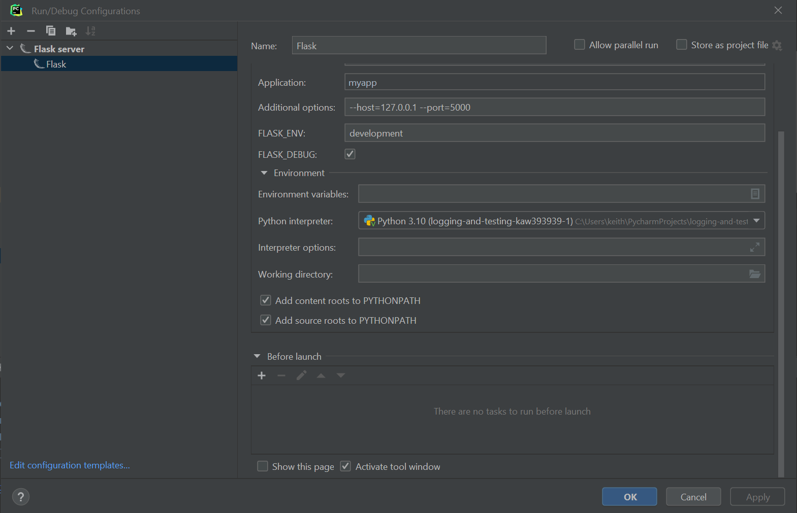

# CSS Introduction

### Name: <Insert Here>

### UCID: <Insert Here>

## Introduction

The purpose of this unit is to introduce you to basic CSS to style your website, so that it conforms to standard website
designs. The purpose of this assignment is to demonstrate how CSS and HTML are used to create a layout that we can use
for next week's assignment. There isn't much for you to do to implement this because I'm giving you all the code;
however, you must read the articles posted and be able to create and maintain the F and Z layouts used in this
assignment, which will eventually become your project for the course.

## Watch: [Assignment Video](https://youtu.be/jTadsuELj_8)

## Assignment Tasks

For this assignment you need to complete the following tasks and my tests will verify that you have completed them:

## Examples

1. [Base Template](base.example)
2. [Index Template](index.example)
3. [Contact page example template](contact.example)
4. [App Code](main_app.example)
5. [Picture of finished site homepage](webpage.png)

### Test Task 1 - 4 Instructions (25 Points Each):

1. Put the CSS code located [here](/style.example) into static/style.css
2. Add a [route](main_app.example) for the contact page and create a [contact page template example](contact.example)
3. Make sure the website homepage looks something like this picture [here](webpage.png) by adding the
   code [here](base.example) to base.html
4. Make sure you add the code for the index page to get the form button from the [index template example](index.example)

## Steps to Complete the Assignment

1. Clone the repo, do pip install -r requirements.txt, and then pytest --pylint all the tests pass
2. Put your name in the README.MD as indicated above. If you don't do this you will get a 0.
3. Run pytest --pylint to see that the test tasks are failing currently and that you need to complete them
4. Setup Pycharm run configuration for flask 
5. When you have completed all the assignment tasks, you will see that all the tests that I created have passed.
6. Submit a link to your GitHub Classroom repository to the Canvas assignment i.e. the one with your GitHub ID in it

### Required Readings - For real

1. [Anatomy of a Web Page - Website Design Terminology](https://blog.tubikstudio.com/anatomy-of-web-page/)
2. [F Layout vs. Z Layout](https://99designs.com/blog/tips/visual-hierarchy-landing-page-designs/)
3. [Anatomy of a HTML Tag](https://developer.mozilla.org/en-US/docs/Learn/Getting_started_with_the_web/HTML_basics)
4. [Flexbox Basics](https://developer.mozilla.org/en-US/docs/Web/CSS/CSS_Flexible_Box_Layout/Basic_Concepts_of_Flexbox)
5. [How Does CSS Work](https://developer.mozilla.org/en-US/docs/Learn/CSS/First_steps/How_CSS_works)
6. [Understanding Links](https://developer.mozilla.org/en-US/docs/Web/HTML/Element/a)
7. [Styling Links](https://developer.mozilla.org/en-US/docs/Learn/CSS/Styling_text/Styling_links)

### References

1. [Fixed Height Footer - flex box instructions](https://css-tricks.com/couple-takes-sticky-footer/)
2. [Complete Guide to Flexbox Layouts](https://css-tricks.com/snippets/css/a-guide-to-flexbox/)
3. [CSS Layout](https://developer.mozilla.org/en-US/docs/Learn/CSS/CSS_layout)

